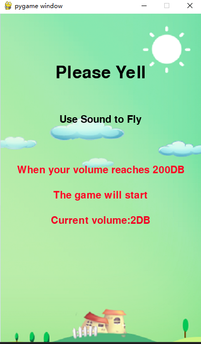
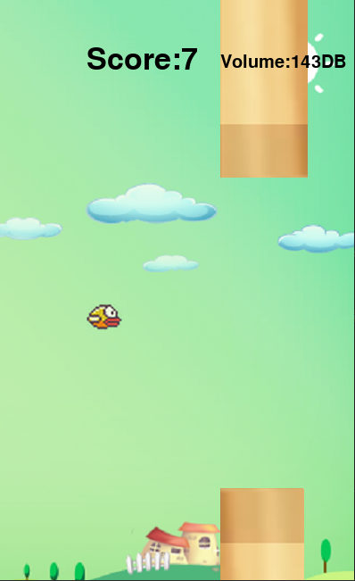
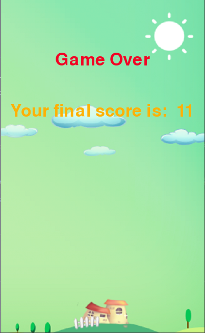

# 尖叫的小鸟
## 作者: kuoluo 用途:人机交互作业
## 游戏介绍
通过音量来控制小鸟飞翔。叫的越响，越快，小鸟飞的越高，但要注意，别撞到上面的水管。
整个游戏既让人在发泄的同时注意控制。
## 游戏安装环境
python 3.6, 需要anaconda
用到的库
```bash
pip install pygame
conda install -c conda-forge numpy
conda install -c conda-forge python-sounddevice
```
## 游戏基本可调参数
全在'''common.py'''中，最常用调解参数为:
```python
DB = 200  # 设置尖叫的分贝阈值
GAME_SPEED = 15  # 设置游戏运行的速度
GAME_DIFFICULTY = 100  # 设置水管随机移动的距离
```
## 游戏打开方式
```bash
python main.py
```
## 游戏运行效果



## 游戏素材获取
https://blog.csdn.net/qq_42554007/article/details/106977545